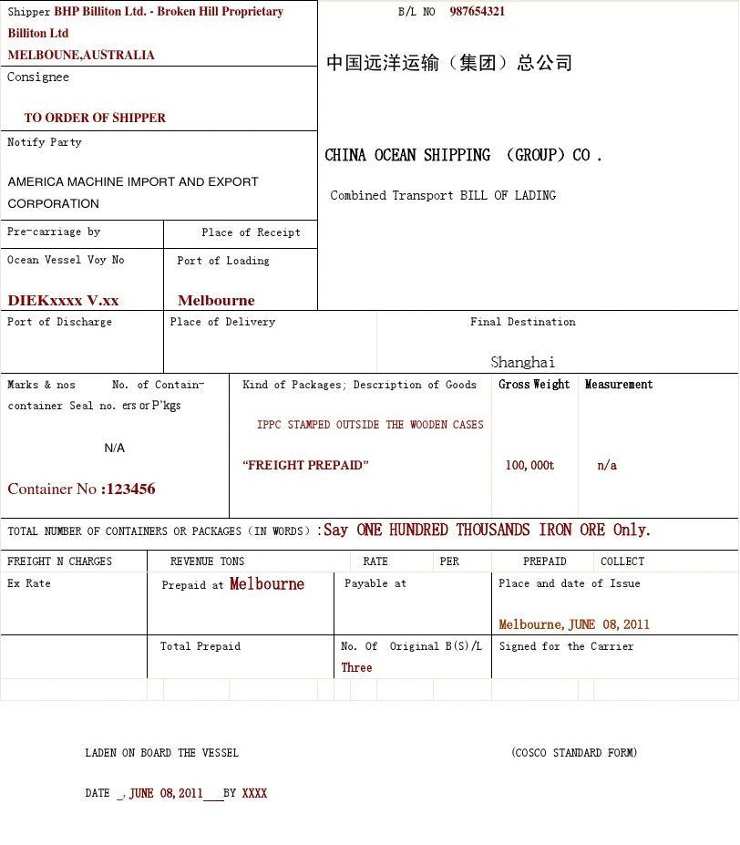
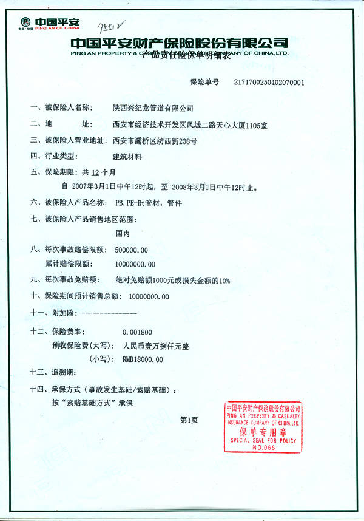
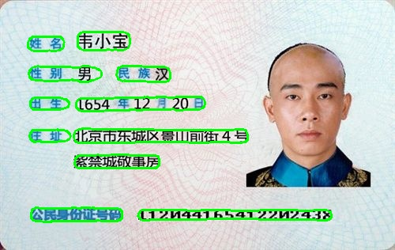
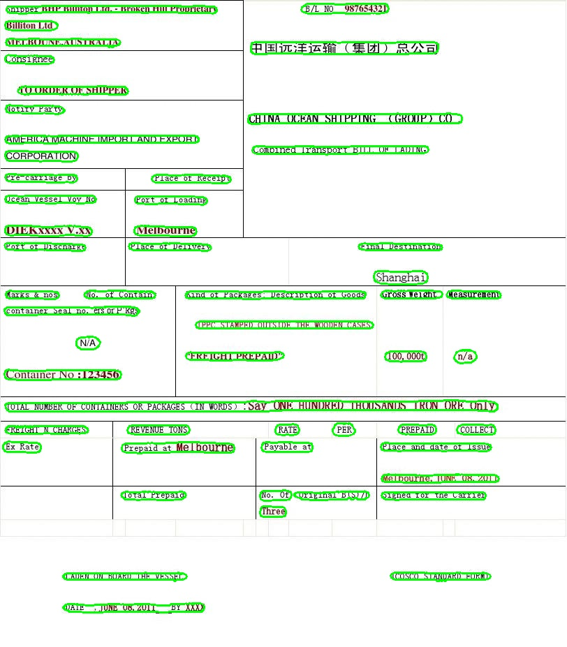
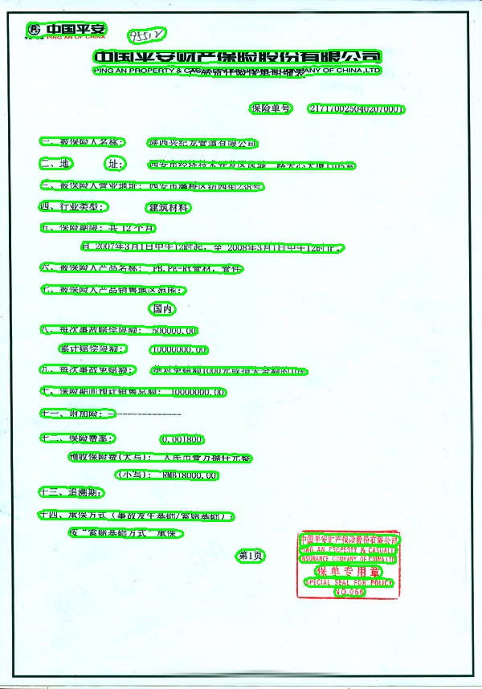

# Introduction
This is a tensorflow2.x implementation of "[Real-time Scene Text Detection with Differentiable Binarization](https://arxiv.org/abs/1911.08947)". 


## Requirements:
- Python3
- TensorFlow >= 2.2.0


## Models
Download Trained models [Baidu Drive](https://pan.baidu.com/s/1FmrK3f_bzwMc93qZ464cPg) (download code: kva3), [Google Drive](https://drive.google.com/file/d/1e0K1AAYECL_-ZpbVqFa65msBZoDhP0sl/view?usp=sharing).


## Datasets
The data set is from [WenmuZhou](https://github.com/WenmuZhou/OCR_DataSet)


## Inference
```bash
python inference.py
```


## Train
```bash
python train.py
```


## Demo
#### input





#### output





